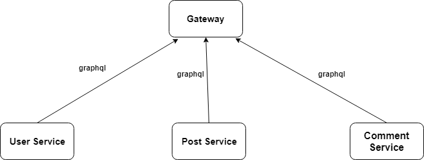
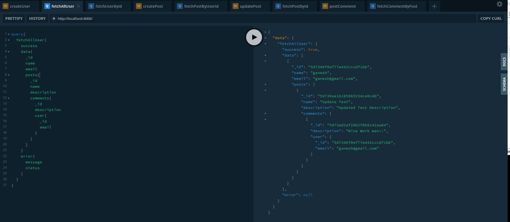

## Building Microservice using Apollo Federation

This repository is a demo of building microservices using Apollo federation. Apollo federation build a single schema in gateway which stitch all the services.All the microservices are in `./services` folder.

It contains the simple blog microservices `user` , `post` and `comment` services which gets connected using `gateway`





### Installation

`User Service`

```
 $ cd services/UserService
 $ npm install
 $ npm run dev 
```

`Post Service`

```
$ cd services/PostService
$ npm install
$ npm run dev
```

` Comment Service `

```
$ cd services/CommentService
$ npm install
$ npm run dev
```

` Gateway `

```
$ npm install
```

This will install all of the dependencies for the gateway and each underlying service

#### Running API Gateway

```
$ npm run start-gateway
```

